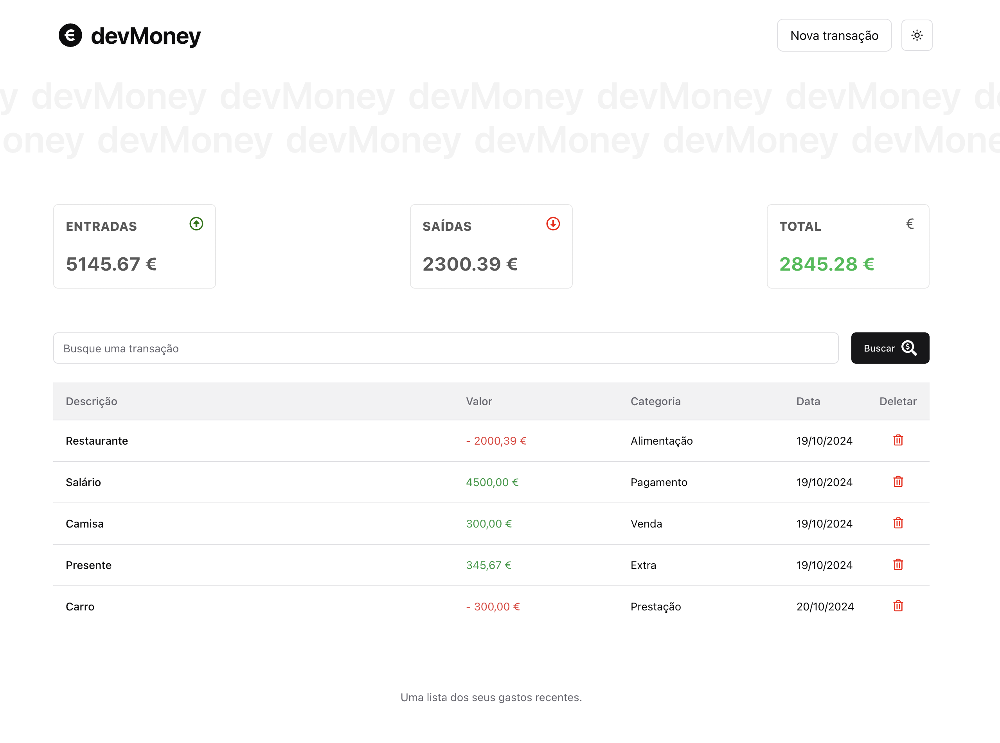
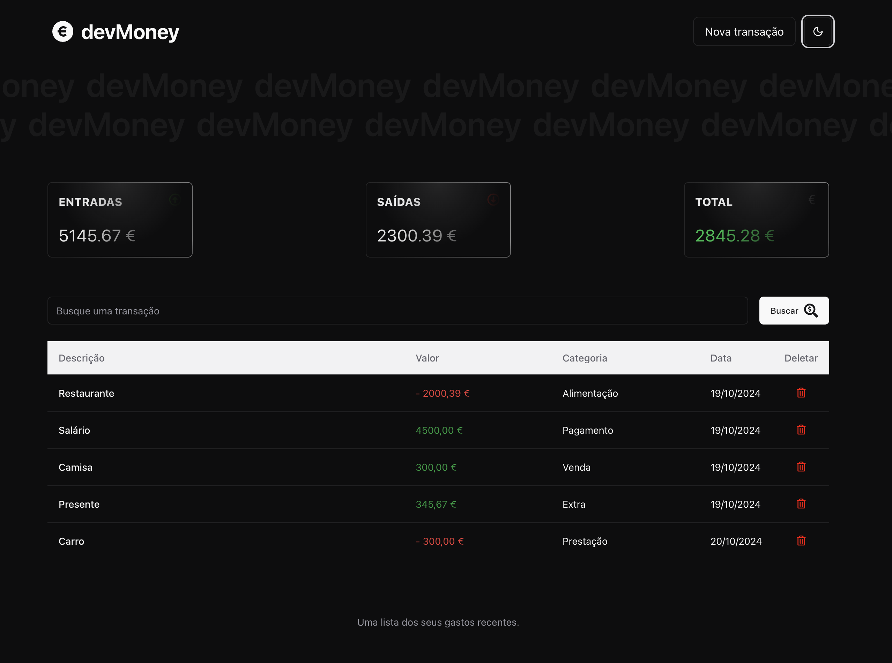
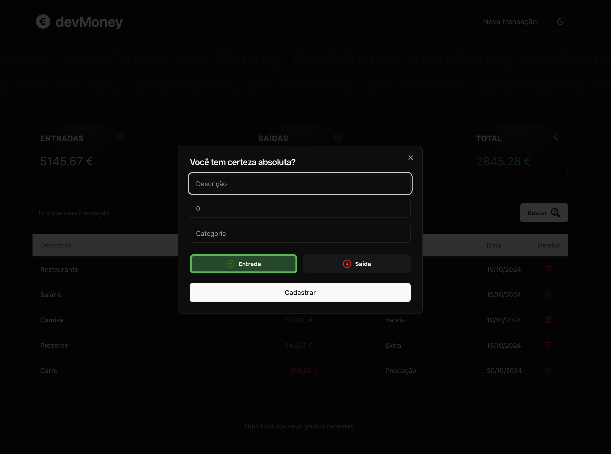
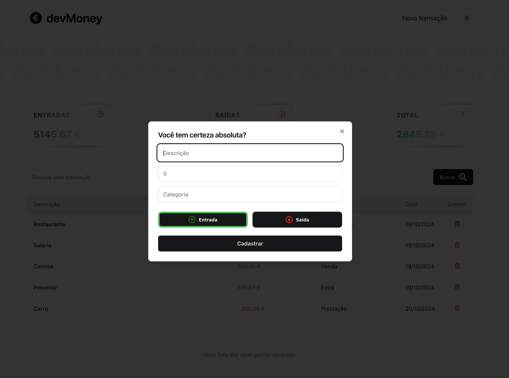
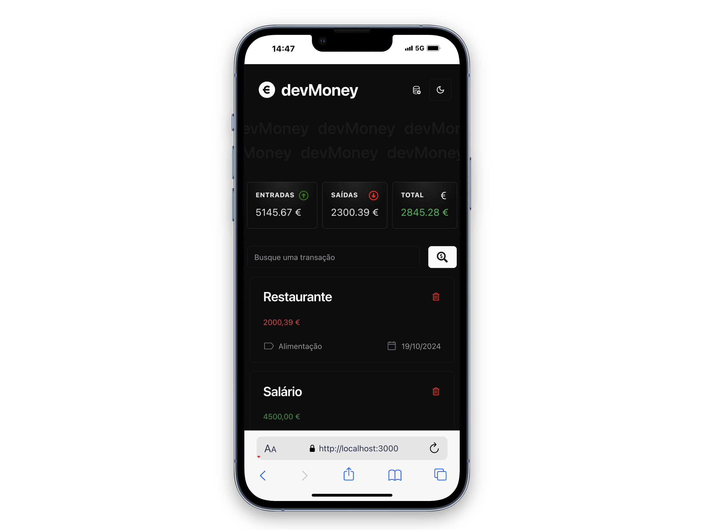
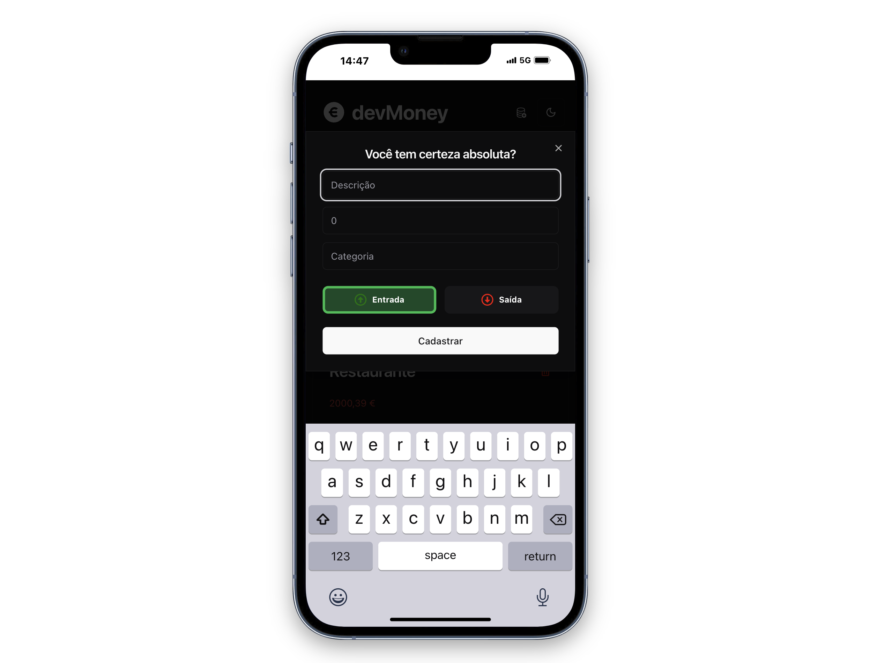
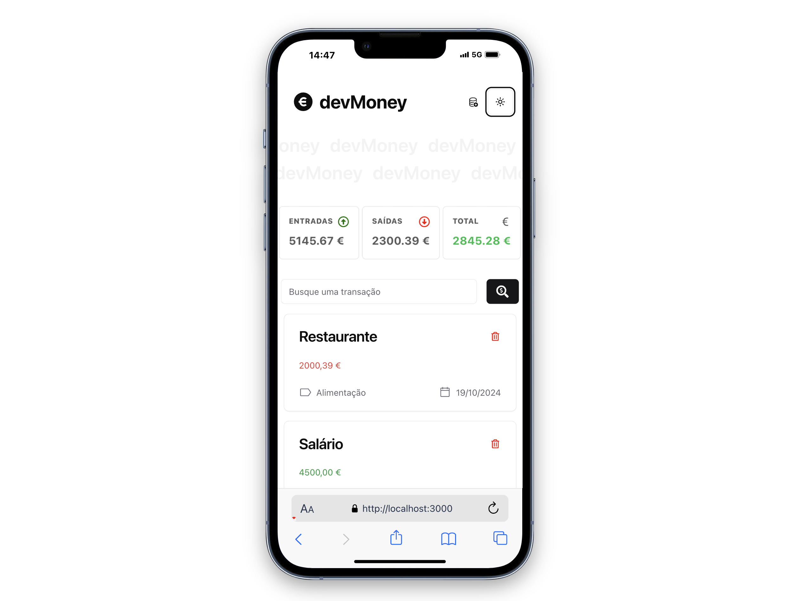
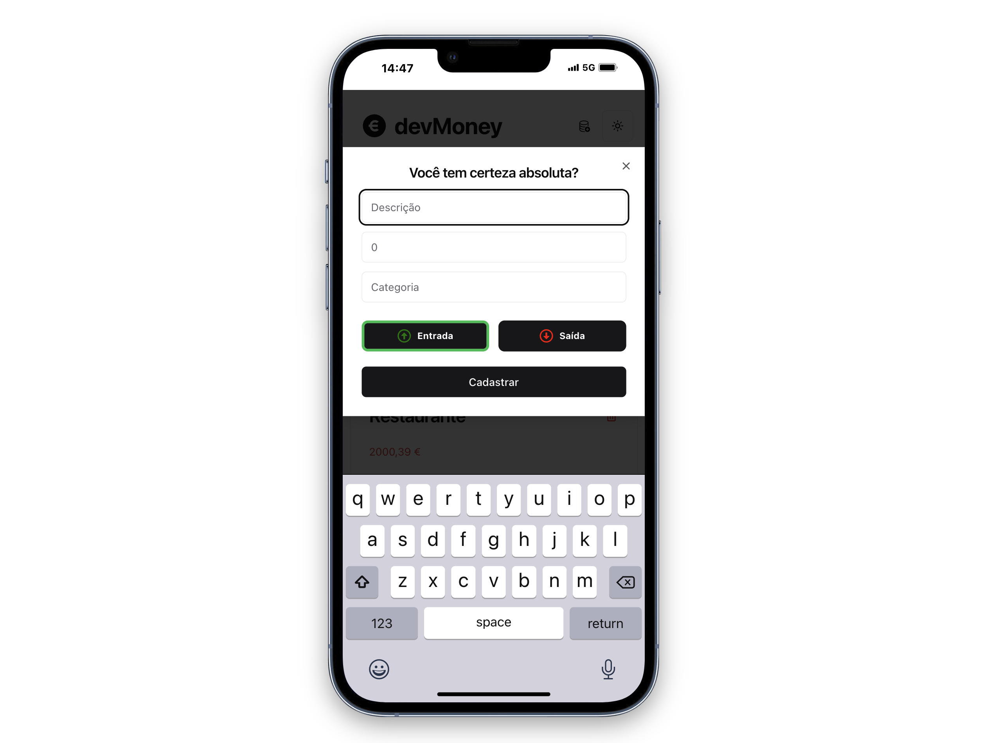

# devMoney

## Deploy
Este projeto está disponível online. Acesse a versão deployada [aqui](https://dev-money-reisdev.vercel.app/) (clique com o botão direito e escolha "Abrir link em uma nova aba").

## Instalação
Para começar a usar este projeto, siga estas etapas:

1. Clone o repositório:
   ```bash
   git clone https://github.com/rodolphoreis/dev-money.git
   cd dev-money
   
   ```

2. **Inicie o servidor de desenvolvimento:**

   ```bash
   npm install

   ```

3. **Inicie o servidor de desenvolvimento:**
    ```bash
   npm run dev

   ```

4. **Inicie o servidor JSON:**
    ```bash
   npm run json-server

   ```
   

5. **Abra o navegador e navegue até** [http://localhost:3000](http://localhost:3000) para a aplicação.
   
6. **Abra o navegador e navegue até** [http://localhost:3001](http://localhost:3001) para o JSON Server.

## Observação

No modo de produção, o aplicativo não terá dados disponíveis, pois o JSON Server funciona apenas em modo de desenvolvimento. Para utilizar uma base de dados real, será necessário integrar uma API adequada.

## Funcionalidades

- Lista de Transações: Visualize todas as transações financeiras com detalhes.
- Filtro de Transações: Filtre as transações por data, tipo e valor.
- Registro de Entradas e Saídas: Adicione novas transações facilmente, lançando entradas e saídas financeiras.
- Operações CRUD: O aplicativo suporta as operações de GET, POST, PUT e DELETE, permitindo que você recupere, crie, atualize e exclua transações.
- Conexão com API: As rotas já estão configuradas para se conectar a uma API real, permitindo a substituição do JSON Server por um banco de dados real futuramente.
- Responsividade: O aplicativo é responsivo e otimizado para dispositivos móveis, garantindo uma boa experiência de usuário em qualquer tela.
- Modos Claro e Escuro: O devMoney oferece a opção de alternar entre os modos claro e escuro, proporcionando uma interface personalizável e confortável para os usuários.

## Imagens do Projeto

  
_Home - Modo claro_

  
_Home - Modo escuro_

  
_Adicionar transação - Modo escuro_


  
_Adicionar transação - Modo claro_

  
_Home Mobile - Modo escuro_

  
_Adicionar transação - Modo escuro - Mobile_

  
_Home Mobile - Modo claro_

  
_Adicionar transação - Modo claro - Mobile_


##  Tecnologias Utilizadas

- Frontend: Next.js, TypeScript, Tailwind CSS, Shadcn UI e Magic UI
- Backend: JSON Server (substituído posteriormente por um banco de dados real)

## Contribuição

Contribuições são bem-vindas! Se você gostaria de contribuir para este projeto, por favor, faça um fork do repositório e envie um pull request com suas alterações.
